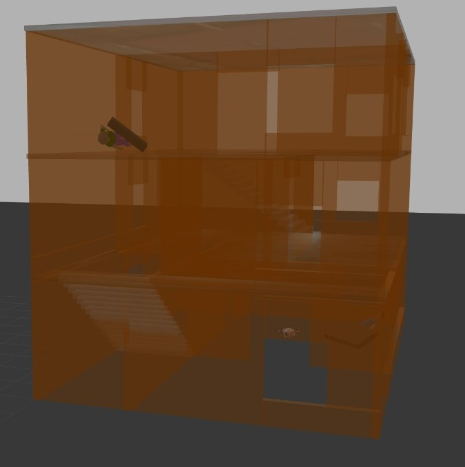
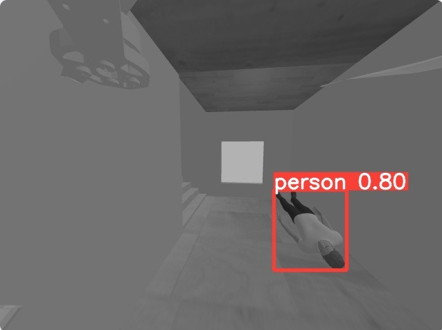
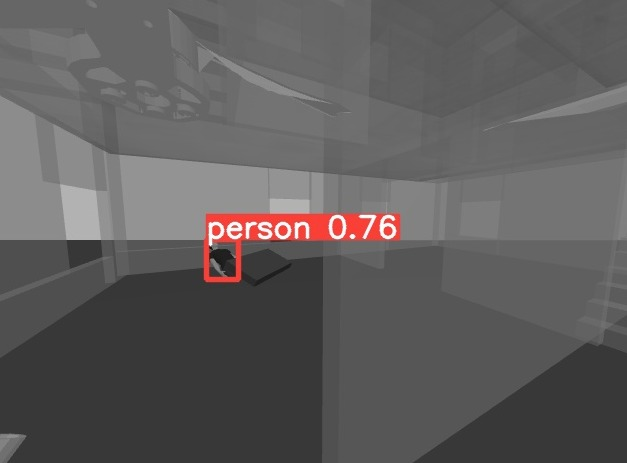
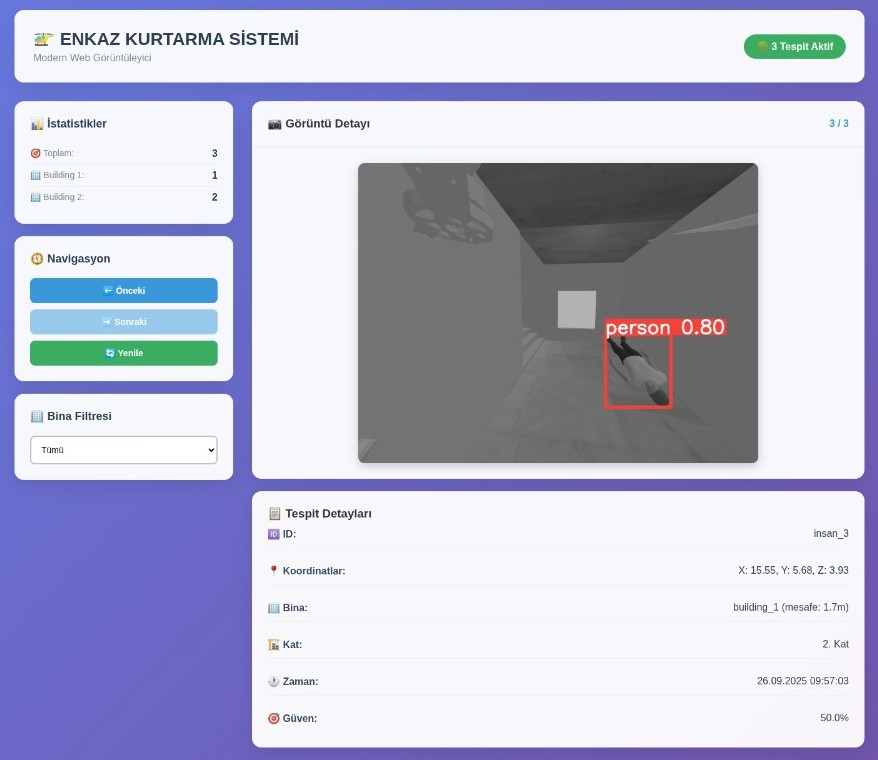
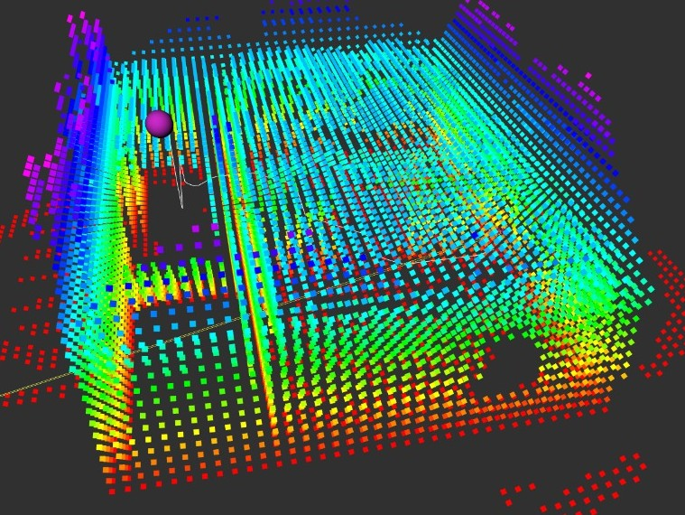
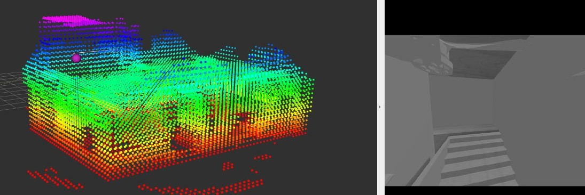

# Autonomous Earthquake SAR Drone

This project focuses on developing an **autonomous drone system** for **Search and Rescue (SAR)** operations in earthquake-affected areas. The drone autonomously explores collapsed or damaged buildings, detects humans, and generates 3D maps of the environment — assisting rescue teams in locating survivors without risking human lives.

---

## 🚀 Project Overview

- **Objective**: Post-earthquake search and rescue using autonomous drones.  
- **Approach**:
  - Human detection with **YOLO** object detection model.  
  - **3D mapping** using **OctoMap** and costmap-based navigation.  
  - **Path planning** with the **A\*** algorithm and trajectory-based following.  
  - **Finite State Machine (FSM)** for mission flow control.  

---

## 🛠️ Technologies Used

- **ROS (Robot Operating System)**  
- **Gazebo** (simulation environment)  
- **YOLO (You Only Look Once)** — real-time human detection  
- **OctoMap & Costmap** — 3D / 2D mapping and navigation  
- **A\*** — path planning  
- **FSM (Finite State Machine)** — mission/state control  
- **Python & C++** — ROS nodes and algorithms  

---

## 📊 Features

- **YOLO-based Human Detection**: Real-time detection of humans and partial body parts (useful in occluded scenes).  
- **3D Mapping (OctoMap)**: Builds 3D voxel-based maps to represent free / occupied / unknown space.  
- **Costmap & Path Planning**: Custom costmap with inflation layers + A* and trajectory following for safe navigation.  
- **Frontier-based / Heuristic Exploration**: Discover unknown regions and generate exploration targets.  
- **Finite State Machine (FSM)**: Mission states (e.g., TAKEOFF → SURVEY → BUILDING_DETECT → EXPLORE → HUMAN_DETECT → REPORT → RETURN).  

---

## 📷 Example Visuals

Below are some example visuals from the project (all located in `assets/`):

- **Build Environment (Gazebo World)**  

- **Human Detection (YOLO) - Case 1**  

- **Human Detection (YOLO) - Case 2**  

- **Environment Exploration**  

- **GUI Interface**  

- **Mapping and Planning (Scenario 1)**  

- **Mapping and Planning (Scenario 2)**  

---

## 🧪 How to Run (example)

1. Clone the repository:
~~~bash
git clone https://github.com/furkanbaran5/Autonomous-Earthquake-SAR-Drone.git
cd Autonomous-Earthquake-SAR-Drone
~~~

2. Build the catkin workspace:
~~~bash
catkin_make
source devel/setup.bash
~~~

3. Launch the Gazebo simulation with the drone and environment:
~~~bash
roslaunch sar_drone simulation.launch
~~~

4. Start YOLO-based detection node:
~~~bash
roslaunch sar_drone yolo_detection.launch
~~~

5. Start mapping and navigation:
~~~bash
roslaunch sar_drone mapping_and_navigation.launch
~~~

> Notes:
> - Replace launch file names above with the actual names in `launch/`.  
> - Ensure camera drivers (or simulated camera topics) are publishing the expected topics.  
> - YOLO may require pre-trained weights to be placed in a specific `weights/` or `models/` folder; check `config/` for exact paths.

---

## 🔧 Configuration & Parameters

Configuration files are in `config/`. Important parameters to tune during tests:

- `voxel_size` / `octomap_resolution` — affects map fidelity and memory.  
- `inflation_radius` (costmap layers) — controls safe distance from obstacles.  
- `planner_timeout`, `max_planning_attempts` — robustness vs. responsiveness trade-offs.  
- YOLO thresholds: `confidence_threshold`, `nms_threshold`.  
- FSM timing: timeouts and retry counts for states.

Use `dynamic_reconfigure` (if available) to tune parameters without rebuilding.

---

## 🧭 FSM (Finite State Machine) — Example Flow

1. **TAKEOFF** — ascend to survey altitude.  
2. **SURVEY** — perform wide-area scan to detect potential buildings.  
3. **BUILDING_DETECT** — run building detection (stack detected buildings).  
4. **EXPLORE** — pop next building from stack and enter exploration state.  
5. **HUMAN_DETECT** — while exploring, run YOLO; if human found → RECORD & REPORT.  
6. **RETURN** — return to base / land (mission finish or battery low).  

(Include `docs/fsm_diagram.png` as a visual representation.)

---

## 🚩 Common Issues & Tips

- **Drone crashes into walls / paths too close**: increase inflation radius and tune costmap inflation layers.  
- **YOLO false positives in low-light**: collect more representative training data or lower confidence threshold carefully.  
- **OctoMap too sparse / noisy**: increase sensor integration rate or lower voxel size (resolution) at cost of memory.  
- **Frequent path replanning causing instability**: stabilize target updates, debounce frontier selection, or limit replanning rate.

---

## 📚 Internship Background

This project was developed during my internship at **Yıldız Technical University — Probabilistic Robotics Research Group (PARS)** (supervisor: Dr. Furkan Çakmak). The internship focused on building a proof-of-concept autonomous SAR drone that integrates computer vision, 3D mapping, and navigation strategies appropriate for damaged indoor environments.

---

## 👨‍💻 Author

**Furkan Baran**  
- Computer Engineering Student, Yıldız Technical University  
- Email: `furkanbarann5@gmail.com`  
- Linkedin: [@furkanbaran5](https://www.linkedin.com/in/furkanbaran5/)

---

## 📝 License

This repository is intended for **educational and research** purposes. You are welcome to fork, adapt, and contribute. If you plan to use the code in deployment or commercial projects, please contact the author.

---
